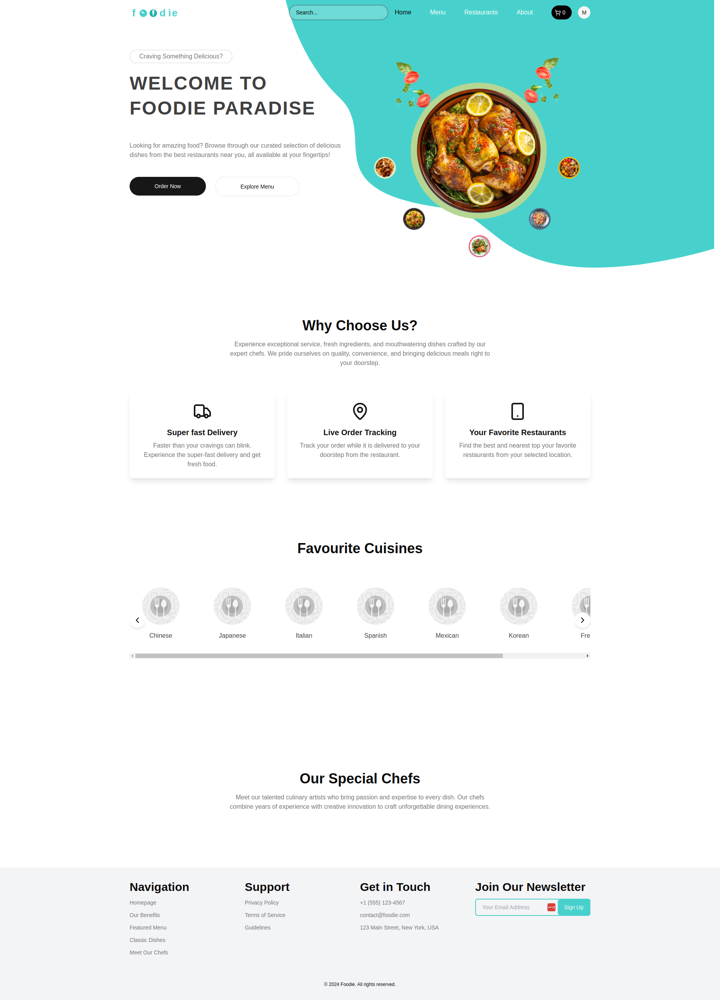

# Foodie - A Multi-Store Restaurant App

Welcome to Foodie, your ultimate destination for discovering and ordering delicious dishes from the best restaurants near you. Our app offers a seamless and delightful experience for food lovers, bringing a variety of cuisines and exceptional service right to your fingertips.

## Features

- **Curated Selection of Dishes:** Browse through a wide range of delicious dishes from top restaurants in your area.
- **Super Fast Delivery:** Enjoy lightning-fast delivery, ensuring your food arrives fresh and hot.
- **Live Order Tracking:** Track your order in real-time as it makes its way from the restaurant to your doorstep.
- **Favorite Restaurants:** Easily find and order from your favorite local restaurants.
- **Exceptional Service:** Experience top-notch service with fresh ingredients and mouthwatering dishes crafted by expert chefs.
- **Special Chefs:** Meet our talented culinary artists who bring passion and expertise to every dish.
- **Dashboard:** Integrated dashboard for admin, owner and customer.

## Live Demo

Check out our live app at [Foodie](https://foodie.manjurulhoque.com/).

## Tech Stack

- **Frontend:** Next.js
- **Backend:** Go (Gin Framework)
- **Database:** PostgreSQL
- **Containerization:** Docker

## Screenshots

*Home page*

## Join Our Community

Stay updated with our latest offerings and promotions by joining our newsletter.

---

© 2025 Foodie. All rights reserved.